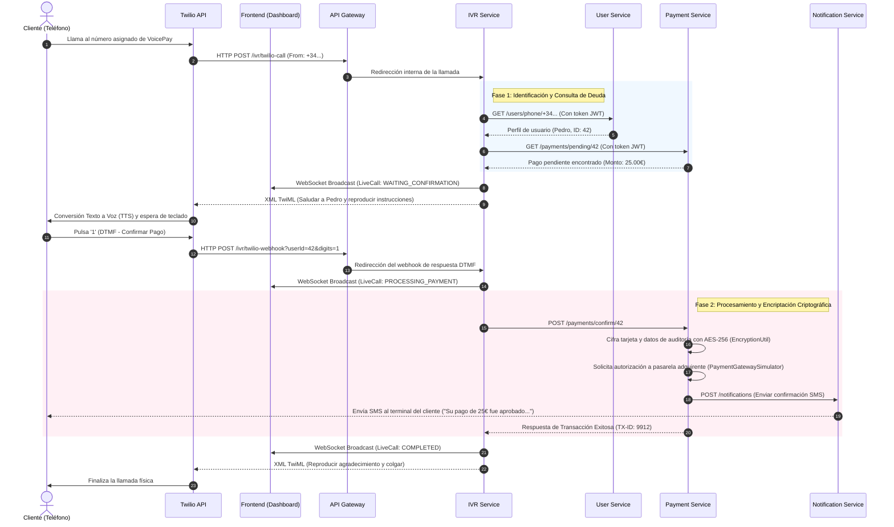

# 📐 Documento de Arquitectura C4 — VoicePay System

Este documento proporciona una visión detallada de la arquitectura técnica del sistema **VoicePay**, estructurada siguiendo el modelo de diseño **C4 (Contexto, Contenedores, Componentes)** junto con diagramas de secuencia detallados de flujo de datos y arquitectura de seguridad.

---

## 🌐 Nivel 1: Diagrama de Contexto de Sistema (System Context)

El Diagrama de Contexto muestra el sistema VoicePay en su entorno, identificando a los usuarios que interactúan con él y las dependencias externas clave (servicios de telefonía, pasarelas de pago y proveedores OAuth).

```mermaid
graph TD
    classDef system fill:#2563eb,stroke:#1d4ed8,stroke-width:2px,color:#ffffff;
    classDef person fill:#0d9488,stroke:#0f766e,stroke-width:2px,color:#ffffff;
    classDef external fill:#4b5563,stroke:#374151,stroke-width:2px,color:#ffffff;
    
    User1[Cliente / Usuario Telefónico]:::person
    User2[Administrador / Comercio]:::person
    
    VP[Sistema VoicePay<br/><i>(Plataforma de Cobro por Voz)</i>]:::system
    
    Twilio[Proveedor de Telefonía<br/><i>(Twilio Cloud)</i>]:::external
    Gateway[Pasarela de Pago Externa<br/><i>(Procesador de Tarjetas)</i>]:::external
    SSO[Proveedores OAuth<br/><i>(Google / Microsoft)</i>]:::external
    
    User1 <-->|Recibe/realiza llamadas e interactúa por voz/DTMF| Twilio
    Twilio <-->|Envía TwiML y webhooks de estado / Dispara llamadas salientes| VP
    User2 <-->|Monitorea llamadas y configura IVR via Dashboard Web| VP
    VP <-->|Procesa y confirma cobros encriptados de tarjeta| Gateway
    VP <-->|Autenticación SSO para inicio de sesión en panel| SSO
```

### Elementos del Contexto

* **Usuario Telefónico (Cliente):** Persona que tiene una deuda pendiente y recibe una llamada del sistema o marca al IVR para realizar un pago seguro introduciendo datos o confirmando con su teclado numérico (DTMF).
* **Administrador / Comercio:** Usuario técnico o comercial que accede al dashboard web para crear flujos IVR mediante arrastrar y soltar (Drag and Drop), monitorizar llamadas en vivo y visualizar estadísticas financieras.
* **Sistema VoicePay:** El núcleo del sistema que expone las APIs del negocio, resuelve el árbol de decisiones telefónico y coordina la seguridad del cobro.
* **Twilio (Proveedor de Telefonía):** Plataforma en la nube encargada del aprovisionamiento de números telefónicos, envío de flujos de audio (SIP/PSTN), conversión de texto a voz (TTS) y captura de tonos DTMF.
* **Pasarela de Pago:** Entidad financiera encargada de autorizar la transacción real de cobro con tarjeta.
* **Proveedores OAuth (Google/Microsoft):** Servicios de identidad federada que permiten un ingreso seguro al panel web administrativo.

---

## 📦 Nivel 2: Diagrama de Contenedores (Container Diagram)

El Diagrama de Contenedores detalla las aplicaciones y bases de datos que componen el sistema **VoicePay**, mostrando puertos de comunicación, protocolos y la pila tecnológica.

```mermaid
graph TB
    subgraph Clientes [Clientes de Entrada]
        Admin[Administrador<br/><i>(Navegador Web)</i>]:::person
        Client[Cliente Telefónico<br/><i>(Teléfono Móvil)</i>]:::person
    end

    subgraph External [Servicios Externos]
        Twilio[Twilio API]:::external
        Bank[Pasarela de Pago]:::external
        SSO[OAuth2 Google / Microsoft]:::external
    end

    subgraph VoicePay [Límites del Sistema VoicePay]
        FE[Frontend Web App<br/><i>(React + Vite + TypeScript)</i>]:::container
        GW[Gateway Service<br/><i>(Spring Cloud Gateway - Port 9000)</i>]:::container
        
        US[User Service<br/><i>(Spring Boot - Port 8080)</i>]:::container
        PS[Payment Service<br/><i>(Spring Boot - Port 8081)</i>]:::container
        IS[IVR Service<br/><i>(Spring Boot - Port 8082)</i>]:::container
        NS[Notification Service<br/><i>(Spring Boot - Port 8083)</i>]:::container
        
        DB[(Base de Datos Postgres<br/><i>PostgreSQL 16 - Port 5432</i>)]:::database
        Vault[HashiCorp Vault<br/><i>Port 8200</i>]:::container
    end

    subgraph Monitoreo [Monitoreo y Observabilidad]
        Prom[Prometheus<br/><i>Port 9090</i>]:::monitor
        Graf[Grafana<br/><i>Port 3000</i>]:::monitor
        Logstash[Logstash<br/><i>TCP Port 5044</i>]:::elk
        ES[Elasticsearch<br/><i>Port 9200</i>]:::elk
        Kib[Kibana<br/><i>Port 5601</i>]:::elk
    end

    Admin -->|Acceso HTTPS / WSS| FE
    Client <-->|Llamadas de voz / DTMF| Twilio
    
    FE -->|Rutas HTTPS / WSS: Puerto 9000| GW
    
    GW -->|Enrutamiento: /users/**| US
    GW -->|Enrutamiento: /payments/** /subscriptions/**| PS
    GW -->|Enrutamiento: /ivr/**| IS
    GW -->|Enrutamiento: /notifications/**| NS
    
    US <-->|Google/Microsoft API| SSO
    
    %% Bases de Datos
    US <-->|Esquema: voicepay_user| DB
    PS <-->|Esquema: voicepay_payment| DB
    IS <-->|Esquema: voicepay_ivr| DB
    NS <-->|Esquema: voicepay_notification| DB
    
    IS <-->|TwiML / Webhooks HTTP| Twilio
    PS <-->|Procesar Pago HTTP| Bank
    
    %% Comunicaciones Inter-servicio
    IS -->|Identifica teléfono / HTTP REST| US
    IS -->|Consulta y confirma deudas / HTTP REST| PS
    PS -->|Valida existencia usuario / HTTP REST| US
    PS -->|Dispara alertas de cobro / HTTP REST| NS
    
    %% Secretos
    US & PS & IS & NS & GW -->|Cargar variables y llaves / HTTP| Vault
    
    %% Logs & Métricas (ELK / Prometheus)
    US & PS & IS & NS & GW -->|Logs TCP JSON| Logstash
    Logstash --> ES
    ES --> Kib
    
    US & PS & IS & NS & GW -->|Métricas Scrape HTTP /actuator| Prom
    Prom --> Graf
    
    classDef person fill:#0d9488,stroke:#0f766e,stroke-width:2px,color:#ffffff;
    classDef container fill:#2563eb,stroke:#1d4ed8,stroke-width:2px,color:#ffffff;
    classDef database fill:#ea580c,stroke:#c2410c,stroke-width:2px,color:#ffffff;
    classDef external fill:#4b5563,stroke:#374151,stroke-width:2px,color:#ffffff;
    classDef monitor fill:#84cc16,stroke:#65a30d,stroke-width:2px,color:#ffffff;
    classDef elk fill:#a855f7,stroke:#9333ea,stroke-width:2px,color:#ffffff;
```

### Relación de Puertos y Responsabilidades de Contenedores

1. **Frontend Web App (React / TS):**
    * **Función:** Interfaz de usuario rica con visualizaciones en tiempo real del flujo de llamadas mediante WebSockets. Cuenta con un editor interactivo de árboles de decisión telefónicos basados en React Flow.
2. **Gateway Service (9000):**
    * **Tecnología:** Spring Cloud Gateway.
    * **Función:** Punto de entrada único. Valida los tokens JWT del frontend y enruta las solicitudes a los microservicios internos.
3. **User Service (8080):**
    * **Función:** Gestión de usuarios (CRUD), autenticación JWT y SSO. Almacena de forma encriptada los datos personales (GDPR).
4. **Payment Service (8081):**
    * **Función:** Gestión de facturas, motor de suscripciones y cobros recurrentes periódicos, tipos de cambio de divisas y generación de reportes financieros (PDF/Excel).
5. **IVR Service (8082):**
    * **Función:** Orquestación telefónica. Traduce las configuraciones de React Flow a TwiML, gestiona el estado en tiempo real de las llamadas en curso y transmite actualizaciones al Frontend por medio de WebSockets.
6. **Notification Service (8083):**
    * **Función:** Despachador de notificaciones. Envía correos de confirmación, alertas SMS y notificaciones push al completarse una transacción.
7. **PostgreSQL 16 (5432):**
    * **Función:** Persistencia de datos estructurados con cuatro esquemas lógicos separados para garantizar el desacoplamiento de datos de cada microservicio.
8. **HashiCorp Vault (8200):**
    * **Función:** Gestión segura de claves criptográficas, credenciales de base de datos, tokens de Twilio y llaves JWT.
9. **ELK Stack & Prometheus/Grafana:**
    * **Función:** Observabilidad total (Métricas de negocio y rendimiento, auditoría y recolección centralizada de logs).

---

## 🧩 Nivel 3: Diagramas de Componentes (Component Diagrams)

A continuación se detallan los componentes internos de los dos microservicios neurálgicos del sistema: `ivr-service` y `payment-service`.

### Componentes de IVR Service (`ivr-service`)

El servicio IVR se encarga de recibir los eventos telefónicos de Twilio, identificar el estado de las llamadas, evaluar el árbol de decisión dinámico y notificar al frontend.

```mermaid
graph TD
    subgraph IvrServiceInternal [Componentes de ivr-service]
        Controller[IvrController<br/><i>(REST Controller)</i>]:::component
        Service[IvrService<br/><i>(Business Service)</i>]:::component
        Broadcaster[LiveCallBroadcaster<br/><i>(WebSocket Handler)</i>]:::component
        CallRepo[LiveCallRepository<br/><i>(Spring Data JPA)</i>]:::component
        FlowRepo[IvrFlowConfigRepository<br/><i>(Spring Data JPA)</i>]:::component
        USClient[UserServiceClient<br/><i>(OpenFeign HTTP Client)</i>]:::feign
        PSClient[PaymentServiceClient<br/><i>(OpenFeign HTTP Client)</i>]:::feign
    end
    
    subgraph ExternalServices [Microservicios del Sistema]
        US[user-service]:::external
        PS[payment-service]:::external
    end
    
    subgraph ClientAndTel [Clientes y Telefonía]
        Twilio[Twilio Voice API]:::external
        WS[Frontend Client via WebSocket]:::external
    end
    
    subgraph Storage [Base de Datos]
        DB[(Esquema Postgres: voicepay_ivr)]:::database
    end
    
    Twilio <-->|TwiML / Webhooks HTTP| Controller
    Controller --> Service
    
    Service --> CallRepo
    Service --> FlowRepo
    Service --> Broadcaster
    Service --> USClient
    Service --> PSClient
    
    USClient -->|HTTP REST| US
    PSClient -->|HTTP REST| PS
    
    Broadcaster -->|Live call state / WSS| WS
    
    CallRepo --> DB
    FlowRepo --> DB
    
    classDef component fill:#3b82f6,stroke:#2563eb,stroke-width:2px,color:#ffffff;
    classDef feign fill:#06b6d4,stroke:#0891b2,stroke-width:2px,color:#ffffff;
    classDef external fill:#4b5563,stroke:#374151,stroke-width:2px,color:#ffffff;
    classDef database fill:#ea580c,stroke:#c2410c,stroke-width:2px,color:#ffffff;
```

* **IvrController:** Expone rutas HTTP para recibir llamadas entrantes simuladas y webhooks de Twilio (`/ivr/twilio-call`, `/ivr/twilio-webhook`, `/ivr/twilio-status`).
* **IvrService:** Lógica central. Obtiene y parsea el flujo JSON almacenado, genera respuestas TwiML dinámicas basadas en plantillas de voz y actualiza el estado de la llamada activa (`LiveCall`).
* **LiveCallBroadcaster:** Notifica al dashboard del frontend cualquier cambio de estado en la llamada activa o un evento en el log de llamadas mediante una conexión WebSocket.
* **Repositories (Call / Flow):** Administran la configuración del árbol IVR guardado por el usuario y registran el historial de llamadas en PostgreSQL.
* **UserServiceClient & PaymentServiceClient:** Clientes declarativos Feign con seguridad JWT que permiten consultar datos de usuario y registrar confirmaciones de pago.

---

### Componentes de Payment Service (`payment-service`)

El servicio de pagos administra transacciones de cobro directo, cobros periódicos recurrentes mediante un planificador, y tipos de cambio multividisa.

```mermaid
graph TD
    subgraph PaymentServiceInternal [Componentes de payment-service]
        PayCtrl[PaymentController<br/><i>(REST Controller)</i>]:::component
        SubCtrl[SubscriptionController<br/><i>(REST Controller)</i>]:::component
        RepCtrl[ReportController<br/><i>(REST Controller)</i>]:::component
        
        PayServ[PaymentService<br/><i>(Business Service)</i>]:::component
        SubServ[SubscriptionService<br/><i>(Business Service)</i>]:::component
        RepServ[ReportService<br/><i>(Business Service)</i>]:::component
        
        Scheduler[SubscriptionScheduler<br/><i>(Spring Scheduler - Cron)</i>]:::component
        Exchange[CurrencyExchangeService<br/><i>(API Client & Cache)</i>]:::component
        Gateway[PaymentGatewaySimulator<br/><i>(Gateway Bridge)</i>]:::component
        Signer[SignatureService<br/><i>(HMAC Signer)</i>]:::component
        Encryptor[EncryptionUtil<br/><i>(AES-256 Crypto)</i>]:::component
        
        PayRepo[PaymentRepository<br/><i>(Spring Data JPA)</i>]:::component
        SubRepo[SubscriptionRepository<br/><i>(Spring Data JPA)</i>]:::component
        
        NSClient[NotificationServiceClient<br/><i>(OpenFeign HTTP Client)</i>]:::feign
        USClient[UserServiceClient<br/><i>(OpenFeign HTTP Client)</i>]:::feign
    end
    
    subgraph ExternalServices [Servicios e Infraestructura]
        US[user-service]:::external
        NS[notification-service]:::external
        GW[API Gateway / Frontend]:::external
        DB[(Esquema Postgres: voicepay_payment)]:::database
    end
    
    GW -->|Rutas /payments| PayCtrl
    GW -->|Rutas /subscriptions| SubCtrl
    GW -->|Rutas /reports| RepCtrl
    
    PayCtrl --> PayServ
    PayCtrl --> Exchange
    SubCtrl --> SubServ
    RepCtrl --> RepServ
    
    Scheduler -->|Barrido programado cada minuto| SubServ
    
    SubServ --> USClient
    SubServ --> PayServ
    SubServ --> NSClient
    
    PayServ --> USClient
    PayServ --> NSClient
    PayServ --> Gateway
    PayServ --> Signer
    PayServ --> Encryptor
    
    PayServ --> PayRepo
    SubServ --> SubRepo
    
    USClient -->|HTTP REST| US
    NSClient -->|HTTP REST| NS
    
    PayRepo --> DB
    SubRepo --> DB
    
    classDef component fill:#3b82f6,stroke:#2563eb,stroke-width:2px,color:#ffffff;
    classDef feign fill:#06b6d4,stroke:#0891b2,stroke-width:2px,color:#ffffff;
    classDef external fill:#4b5563,stroke:#374151,stroke-width:2px,color:#ffffff;
    classDef database fill:#ea580c,stroke:#c2410c,stroke-width:2px,color:#ffffff;
```

* **Controllers (Payment, Subscription, Report):** Exponen APIs para la creación y visualización de cobros, reportes PDF/Excel, y creación y cancelación de suscripciones periódicas.
* **PaymentService & SubscriptionService:** Lógica de negocio para validar la existencia de transacciones y gestionar el ciclo de vida de cobros únicos o contratos recurrentes.
* **SubscriptionScheduler:** Hilo demonio de Spring Boot (`@Scheduled`) que corre en segundo plano y realiza un barrido cada minuto evaluando qué suscripciones activas han expirado (`nextPaymentDate <= now`) para gatillar su cobro de forma autónoma.
* **EncryptionUtil & SignatureService:** Componentes de seguridad. Cifran campos sensibles de tarjetas mediante AES-256 GCM e implementan firmas criptográficas para asegurar la integridad de los datos financieros.
* **CurrencyExchangeService:** Módulo encargado de convertir montos entre divisas (EUR, USD, GBP, etc.) basándose en tasas de mercado actualizadas desde APIs financieras de tipo de cambio.
* **PaymentGatewaySimulator:** Conexión simulada con la red adquirente de tarjetas. Simula latencias, rechazos de fondos y códigos de autorización bancaria.

---

## 🔄 Flujo de Datos (Data Flow — Ciclo de Pago Telefónico)

Este diagrama ilustra la secuencia temporal y el flujo de datos exacto desde que un cliente inicia la llamada telefónica hasta que la transacción se completa, se encripta y se notifica al dashboard en tiempo real.



---

## 🔒 Arquitectura de Seguridad y Flujo de Secretos

Para cumplir con normativas de seguridad de datos de pago (equivalentes a PCI-DSS) y protección de datos personales (GDPR), el sistema implementa una infraestructura de seguridad por capas:

1. **Cifrado en Reposo (Database Encryption):**
    * Campos sensibles en la base de datos (tales como números de tarjetas de crédito parciales, nombres y teléfonos) son cifrados simétricamente mediante **AES-256 en modo GCM** antes de ser insertados en PostgreSQL (`EncryptionUtil` y `EncryptionConverter`).
    * Se utiliza un convertidor JPA para realizar el cifrado/descifrado transparente en las entidades `User` y `Payment`.
2. **Integridad de Datos (Firmas criptográficas):**
    * Las transacciones y reportes contienen firmas criptográficas de tipo HMAC-SHA256 para evitar alteraciones o manipulaciones maliciosas de montos o estados financieros en tránsito.
3. **Gestión de Secretos Dinámica (Vault):**
    * Ningún archivo de configuración contiene contraseñas o llaves API en texto plano (`hardcoded secrets`).
    * Durante el arranque, cada microservicio se conecta de forma segura a **HashiCorp Vault** (puerto `8200`) para inyectar dinámicamente las llaves simétricas AES, los secrets de JWT, los tokens de Twilio y los credenciales de acceso a PostgreSQL.
4. **Autenticación y Autorización (JWT / OAuth2):**
    * Las peticiones externas dirigidas al API Gateway requieren un token Bearer JWT válido.
    * La comunicación inter-servicios se asegura mediante la generación automática de tokens JWT efímeros firmados por el servicio emisor, los cuales son validados por filtros de seguridad de Spring Security en cada endpoint.
