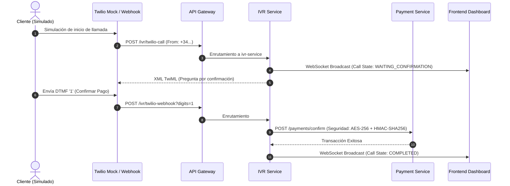

# 🧪 Estrategia de Testing y Garantía de Calidad (QA) — VoicePay System

Este documento establece la metodología, arquitectura de pruebas y directrices de cobertura de código para asegurar la estabilidad, seguridad e integridad financiera de la plataforma **VoicePay System**.

---

## 📐 1. Arquitectura de Testing (Pirámide de Pruebas)

Seguimos una estrategia basada en la **Pirámide de Pruebas**, priorizando las pruebas unitarias rápidas y ligeras, complementadas con pruebas de integración focalizadas y un conjunto robusto de simulaciones de llamadas E2E (End-to-End).

```mermaid
graph TD
    classDef e2e fill:#f43f5e,stroke:#e11d48,stroke-width:2px,color:#ffffff;
    classDef integration fill:#3b82f6,stroke:#2563eb,stroke-width:2px,color:#ffffff;
    classDef unit fill:#10b981,stroke:#059669,stroke-width:2px,color:#ffffff;

    E2E[Pruebas E2E / Simulación IVR<br/><i>(Twilio Call Playwright / Script-based)</i>]:::e2e
    Integration[Pruebas de Integración<br/><i>(Spring Boot Test + H2 Postgres + Feign Mocks)</i>]:::integration
    Unit[Pruebas Unitarias<br/><i>(JUnit 5 + Mockito / Vitest + RTL)</i>]:::unit

    E2E --> Integration
    Integration --> Unit
```

### Tabla Resumen de Enfoques

| Nivel de Test | Ámbito | Frecuencia de Ejecución | Tecnologías / Frameworks | Velocidad |
| :--- | :--- | :--- | :--- | :--- |
| **Unitario** | Lógica de negocio aislada, servicios, utilidades criptográficas, lógica de componentes frontend. | En cada commit (Local) & CI Pipeline (GitHub Actions). | JUnit 5 + Mockito (Backend) / Vitest + RTL (Frontend) | Ultra-rápido (< 1s por clase) |
| **Integración** | API REST, persistencia de datos (H2), comunicación inter-servicio. | Pre-merge a rama de desarrollo y PRs en CI. | `@SpringBootTest` + MockMvc (Backend) | Medio (15s - 45s por servicio) |
| **E2E / Simulación** | Flujo completo de cobro: llamada física/simulada -> Webhooks -> Cifrado -> Confirmación por SMS/Email -> WebSocket dashboard. | Pruebas de regresión semanales o pre-release. | Playwright + Python / Node Call Simulator | Lento (1m - 3m por flujo completo) |

---

## ⚡ 2. Pruebas Unitarias (Unit Testing)

Las pruebas unitarias deben validar el comportamiento de una clase en total aislamiento. Queda prohibida la carga del contexto de Spring o el acceso a red o base de datos en este nivel.

### ☕ Backend (Spring Boot - Java 21)

* **Objetivo:** Probar servicios, utilidades de seguridad (cifrado, firmas), DTOs y validaciones.
* **Directrices:**

  * Usar la extensión de Mockito (`@ExtendWith(MockitoExtension.class)`) para inicializar los mocks de forma ultra-rápida sin arrancar Spring.
  * Usar `@Mock` para inyectar dependencias simuladas (repositorios, clientes REST, servicios externos) y `@InjectMocks` sobre la clase bajo prueba.
  * Usar **AssertJ** (`assertThat(...)`) para aserciones legibles y semánticas.

#### Ejemplo de Estructura recomendada

```java
@ExtendWith(MockitoExtension.class)
class PaymentServiceUnitTest {

    @Mock
    private PaymentRepository paymentRepository;

    @Mock
    private UserServiceClient userServiceClient;

    @InjectMocks
    private PaymentService paymentService;

    @Test
    void testProcessPayment_Success() {
        // Arrange (Configuración de Mocks y Datos)
        PaymentRequest request = new PaymentRequest(10L, new BigDecimal("25.00"), "EUR");
        when(userServiceClient.validateUser(10L)).thenReturn(new UserDto(10L, "Pedro", "+34600112233"));
        when(paymentRepository.save(any(Payment.class))).thenAnswer(i -> i.getArgument(0));

        // Act (Ejecución del método)
        PaymentResponse response = paymentService.processPayment(request);

        // Assert (Verificación de resultados)
        assertThat(response).isNotNull();
        assertThat(response.getStatus()).isEqualTo("APPROVED");
        verify(paymentRepository, times(1)).save(any(Payment.class));
    }
}
```

### ⚛️ Frontend (React - Vite)

* **Objetivo:** Probar componentes de interfaz de usuario de forma aislada, hooks personalizados de Zustand y funciones de formateo/utilidades.
* **Directrices:**

  * Implementar **Vitest** como motor de ejecución de tests y **React Testing Library (RTL)** para el renderizado y aserciones sobre el DOM virtual.
  * Utilizar `@testing-library/user-event` para simular interacciones reales del teclado/ratón.
  * Simular las APIs de Red utilizando mocks de Axios o Mock Service Worker (MSW).

> [!TIP]
> **Mejor Práctica:** No testear detalles de implementación del componente (como estados internos), sino la interacción y el comportamiento visible para el usuario (p. ej., asegurar que un botón de confirmación invoque la acción correcta y se inhabilite tras ser presionado).

---

## ⛓️ 3. Pruebas de Integración (Integration Testing)

Las pruebas de integración verifican la interacción entre múltiples componentes del sistema o con bases de datos y APIs internas.

### ☕ Backend (Spring Boot)

* **Objetivo:** Probar controladores de entrada (Endpoints REST), flujos completos de servicios de base de datos (con JPA) y la lógica de deserialización/seguridad.
* **Configuración del Entorno de Pruebas:**

  * Las pruebas de integración se configuran con `@SpringBootTest(webEnvironment = SpringBootTest.WebEnvironment.RANDOM_PORT)`.
  * **Base de Datos en Memoria:** Se utiliza **H2** configurado con compatibilidad PostgreSQL (`MODE=PostgreSQL`) para simular la base de datos real sin requerir una base de datos en ejecución.
  * **Aislamiento de Secretos:** Se deshabilita la conexión en caliente con HashiCorp Vault en el archivo de propiedades de test (`spring.cloud.vault.enabled=false`) para evitar dependencias externas.

> [!WARNING]
> **Evitar APIs externas en Caliente:** Actualmente, servicios como `CurrencyExchangeService` consumen APIs reales (`https://open.er-api.com/...`) durante los tests, lo que introduce fragilidad (flakiness) si la red falla o la API externa tiene límites de tasa (Rate Limits).
> **Acción Correctiva Obligatoria:** Reemplazar estos consumos reales en los tests utilizando **WireMock** para simular la API de tipo de cambio, o inyectar una implementación simulada de test.

#### Ejemplo de Test de Integración

```java
@SpringBootTest(webEnvironment = SpringBootTest.WebEnvironment.RANDOM_PORT)
@AutoConfigureMockMvc
@ActiveProfiles("test")
class UserControllerIntegrationTest {

    @Autowired
    private MockMvc mockMvc;

    @Autowired
    private UserRepository userRepository;

    @Test
    void testCreateUser_Integration() throws Exception {
        String userJson = "{\"name\":\"Carlos\",\"phone\":\"+34600998877\",\"email\":\"carlos@voicepay.com\"}";

        mockMvc.perform(post("/users")
                .contentType(MediaType.APPLICATION_JSON)
                .content(userJson))
                .andExpect(status().isCreated())
                .andExpect(jsonPath("$.id").exists())
                .andExpect(jsonPath("$.name").value("Carlos"));

        assertThat(userRepository.findByPhone("+34600998877")).isPresent();
    }
}
```

---

## 📞 4. Pruebas End-to-End (E2E) y Simulación de IVR

Las pruebas E2E validan los flujos completos cruzando los límites del sistema (desde el canal telefónico hasta la actualización del dashboard administrativo).

### 🔄 Arquitectura del Flujo E2E



### 🐍 Metodología de Simulación

Para validar el flujo telefónico en un entorno local o de CI/CD sin gastar créditos reales de Twilio, el sistema incluye scripts de simulación:

1. **`simulate_ivr_call.py` (Python)**

   * Envía payloads que imitan exactamente la estructura de parámetros de Twilio (`CallSid`, `From`, `Digits`, `SpeechResult`).
   * Envía el POST inicial para gatillar la llamada (`/ivr/twilio-call`) y luego responde simulando interacciones DTMF (`/ivr/twilio-webhook`).
   * Permite verificar de forma automatizada que las respuestas del `ivr-service` devuelven cabeceras XML válidas (`application/xml`) y etiquetas `<Response>`, `<Say>`, `<Gather>` estructuradas correctamente.

2. **Verificación de Telemetría en Tiempo Real**

   * Durante la simulación, se verifica que la llamada sea transmitida vía WebSockets mediante la interfaz interactiva `ws-tester.html` o los flujos interactivos de **React Flow** del Dashboard.
   * El estado de la llamada activa (`LiveCall`) debe evolucionar secuencialmente: `WAITING_CONFIRMATION` ➡️ `PROCESSING_PAYMENT` ➡️ `COMPLETED` o `FAILED`.

3. **Garantía Criptográfica**

   * Se debe validar en las aserciones que los datos de pago sensibles procesados en el flujo E2E terminen encriptados en la base de datos mediante el algoritmo **AES-256 GCM** y cuenten con su correspondiente firma digital **HMAC-SHA256** para prevenir fraude o manipulación externa.

---

## 📈 5. Cobertura y Métricas de Calidad (Code Coverage)

Definimos umbrales de aceptación obligatorios (Quality Gates) aplicados en el pipeline de desarrollo para impedir que código sin tests sea subido a producción.

### 📊 Métricas Objetivo

| Componente | Métrica | Umbral Mínimo | Herramienta |
| :--- | :--- | :--- | :--- |
| **Backend (Java)** | Cobertura de Líneas (Line Coverage) | **80%** | JaCoCo |
| **Backend (Java)** | Cobertura de Ramas (Branch Coverage) | **70%** | JaCoCo |
| **Frontend (React)** | Cobertura de Líneas (Line Coverage) | **75%** | Vitest (v8/istanbul) |
| **Seguridad / Criptografía** | Cobertura de Líneas | **100%** | JaCoCo |

### 🛠️ Configuración de JaCoCo en Backend

Para activar las métricas en Maven, se debe incluir el plugin de JaCoCo en el `pom.xml` padre o en cada submódulo:

```xml
<plugin>
    <groupId>org.jacoco</groupId>
    <artifactId>jacoco-maven-plugin</artifactId>
    <version>0.8.11</version>
    <executions>
        <execution>
            <goals>
                <goal>prepare-agent</goal>
            </goals>
        </execution>
        <execution>
            <id>report</id>
            <phase>test</phase>
            <goals>
                <goal>report</goal>
            </goals>
        </execution>
        <!-- Umbrales mínimos obligatorios (Quality Gate) -->
        <execution>
            <id>jacoco-check</id>
            <goals>
                <goal>check</goal>
            </goals>
            <configuration>
                <rules>
                    <rule>
                        <element>BUNDLE</element>
                        <limits>
                            <limit>
                                <counter>LINE</counter>
                                <value>COVEREDRATIO</value>
                                <minimum>0.80</minimum>
                            </limit>
                            <limit>
                                <counter>BRANCH</counter>
                                <value>COVEREDRATIO</value>
                                <minimum>0.70</minimum>
                            </limit>
                        </limits>
                    </rule>
                </rules>
            </configuration>
        </execution>
    </executions>
</plugin>
```

### 🔍 Análisis Estático (SonarQube)

Cada despliegue en la rama de integración debe correr una inspección de código automatizada:

* **Seguridad:** Ningún secreto en texto plano (Hardcoded Secrets). Detección automática mediante analizadores de firmas criptográficas.
* **Bugs y Vulnerabilidades:** Cumplimiento de reglas de diseño seguras (e.g. validación de entradas de controladores contra Inyección SQL y desbordamientos).
* **Mantenibilidad:** Identificación de duplicación de código (duplication ratio < 3%) y control de complejidad ciclomática.

---

## 🚀 6. Pipeline de CI/CD (Automatización de Calidad)

Todas las pruebas descritas se ejecutan de manera automatizada ante cualquier evento de Pull Request o Push hacia la rama `main` o `develop`.

```yaml
# .github/workflows/ci-pipeline.yml
name: CI Quality & Testing Pipeline

on:
  push:
    branches: [ main, develop ]
  pull_request:
    branches: [ main, develop ]

jobs:
  backend-test:
    name: Backend Build & Test (Java 21)
    runs-on: ubuntu-latest
    
    steps:
      - name: Checkout Code
        uses: actions/checkout@v4

      - name: Set up JDK 21
        uses: actions/setup-java@v4
        with:
          java-version: '21'
          distribution: 'temurin'
          cache: 'maven'

      - name: Run Maven Tests with JaCoCo Coverage
        run: ./mvnw clean test

      - name: Upload JaCoCo Coverage Report
        uses: actions/upload-artifact@v4
        with:
          name: jacoco-reports
          path: "**/target/site/jacoco/"

  frontend-test:
    name: Frontend Build & Test (React)
    runs-on: ubuntu-latest
    
    steps:
      - name: Checkout Code
        uses: actions/checkout@v4

      - name: Set up Node.js
        uses: actions/setup-node@v4
        with:
          node-version: '20'
          cache: 'npm'
          cache-dependency-path: voicepay-frontend/package-lock.json

      - name: Install dependencies
        run: npm ci
        working-directory: voicepay-frontend

      - name: Run Linter
        run: npm run lint
        working-directory: voicepay-frontend

      - name: Run Unit Tests with Coverage
        run: npm run test:coverage
        working-directory: voicepay-frontend
        continue-on-error: true # Permitir continuar en lo que se terminan de acoplar tests frontend
```
