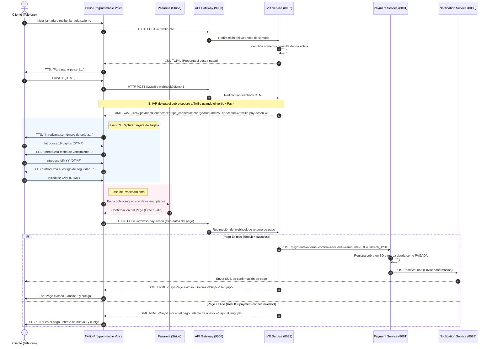

# 💳 Integración de Twilio Pay con la Pasarela de Pagos (Stripe)

Este documento describe la arquitectura técnica, la configuración y el flujo de comunicación necesarios para integrar **Twilio Pay** utilizando el verbo `<Pay>` de TwiML y una pasarela adquirente (por ejemplo, **Stripe**) como procesador de pagos seguro y compatible con PCI-DSS en el sistema **VoicePay**.

---

## ⚙️ 1. Configuración de Pasarela en Twilio Console

Para que Twilio Pay pueda procesar cobros y tokenizaciones con tarjetas, se debe habilitar el **Modo PCI** y configurar un **Payment Connector** en la consola de Twilio.

### Paso 1: Habilitar Modo PCI (PCI Mode)
1. Inicie sesión en la [Consola de Twilio](https://console.twilio.com/).
2. En el menú de navegación izquierdo, vaya a **Voice > Settings > General**.
3. Desplácese hasta la sección **PCI Mode**.
4. Seleccione **Enable PCI Mode**.
   > [!WARNING]
   > Habilitar el Modo PCI es permanente. Una vez activo, Twilio redactará de manera automática los datos confidenciales de tarjetas de los logs de la plataforma para mantener el cumplimiento normativo.
5. Acepte los términos de servicio y haga clic en **Save**.

### Paso 2: Instalar y Configurar el Pay Connector (Stripe)
1. En la consola de Twilio, navegue a **Voice > Manage > Pay Connectors**.
2. Encontrará una lista de conectores de marca (Stripe, Chase Paymentech, Braintree, etc.) y un conector genérico. Seleccione **Stripe**.
3. Haga clic en **Install** o **Configure**.
4. Se le redirigirá a Stripe (vía OAuth) para autorizar a Twilio a realizar cargos en su nombre. Inicie sesión con la cuenta de Stripe del comercio y confirme la vinculación.
5. Una vez completado, regrese a la consola de Twilio. El conector se guardará con un **Unique Name** (por ejemplo, `stripe_connector`). Este nombre único es la credencial que se usará en el atributo `paymentConnector` del TwiML.

### Paso 3: Generación de Endpoint y Credenciales de Prueba
*   Durante el proceso de configuración en Stripe, puede elegir vincular el conector en **modo de prueba (Sandbox/Test Mode)** utilizando sus llaves de API de prueba de Stripe (`sk_test_...`).
*   Esto le proveerá un entorno seguro en el que puede usar números de tarjeta de prueba para validar todo el flujo de cobros sin transferencias reales de dinero.

---

## 🔄 2. Ciclo de Vida de la Petición (Sequence Diagram)

El siguiente diagrama ilustra cómo fluye la llamada, la captura segura de datos por Twilio (PCI-Compliant) y el webhook de confirmación final en el backend de VoicePay.



---

## 📥 3. Estructura y Parámetros del Webhook de Retorno (`action`)

Cuando el verbo `<Pay>` finaliza la interacción (sea por éxito o error), Twilio envía una petición `HTTP POST` con el tipo de contenido `application/x-www-form-urlencoded` a la URL configurada en el atributo `action`.

### Parámetros Principales del Webhook

| Parámetro | Tipo | Descripción |
| :--- | :--- | :--- |
| `Result` | String | **Resultado general.** Posibles valores:<br/>- `success`: El pago se completó correctamente.<br/>- `payment-connector-error`: Rechazo o fallo en la pasarela.<br/>- `caller-interrupted-with-star`: El usuario canceló pulsando `*`.<br/>- `caller-hung-up`: El cliente colgó.<br/>- `validation-error`: Error de validación en los inputs DTMF. |
| `PaymentStatus` | String | **Estado de la transacción.** `complete` o `failed`. |
| `PaymentCardType`| String | **Tipo de tarjeta detectada.** `visa`, `mastercard`, `amex`, `discover`, `jcb`, etc. |
| `PaymentError` | String | **Detalle amigable del error.** Ejemplos: `card is declined`, `invalid-security-code`, `invalid-postal-code`. |
| `PayErrorCode` | String | **Código de error de Twilio.** Por ejemplo, `11100` para problemas generales de conexión con la pasarela. |
| `ConnectorError` | String | **Error bruto retornado por Stripe.** El mensaje o código HTTP directo de la API adquirente. |
| `ChargeSid` | String | El ID de cargo único asignado por Twilio. |
| `PaymentToken` | String | Token generado por Stripe si se realizó una tokenización (`chargeAmount` = 0). |
| `CallSid` | String | Identificador único de la llamada en Twilio. |
| `AccountSid` | String | Identificador único de la cuenta de Twilio. |

### Ejemplos de Cargas Útiles (Payloads)

#### A. Webhook de Retorno Exitoso (Success)
```http
POST /ivr/twilio-pay-action?userId=42 HTTP/1.1
Host: gateway.voicepay.com
Content-Type: application/x-www-form-urlencoded

AccountSid=ACxxxxxxxxxxxxxxxxxxxxxxxxxxxxxxxx
CallSid=CAxxxxxxxxxxxxxxxxxxxxxxxxxxxxxxxx
Result=success
PaymentStatus=complete
PaymentCardType=visa
ChargeSid=CHxxxxxxxxxxxxxxxxxxxxxxxxxxxxxxxx
paymentConnector=stripe_connector
chargeAmount=25.00
```

#### B. Webhook de Retorno Fallido (Tarjeta Declinada / Error en Pasarela)
```http
POST /ivr/twilio-pay-action?userId=42 HTTP/1.1
Host: gateway.voicepay.com
Content-Type: application/x-www-form-urlencoded

AccountSid=ACxxxxxxxxxxxxxxxxxxxxxxxxxxxxxxxx
CallSid=CAxxxxxxxxxxxxxxxxxxxxxxxxxxxxxxxx
Result=payment-connector-error
PaymentStatus=failed
PaymentError=card+is+declined
PayErrorCode=11115
ConnectorError=card_declined
paymentConnector=stripe_connector
chargeAmount=25.00
```

---

## 🛠️ 4. Implementación Sugerida en VoicePay

Para soportar Twilio Pay en el código, se sugieren los siguientes cambios en `ivr-service` y `payment-service`:

### A. IVR Service (`ivr-service`)
Crear un endpoint en `IvrController.java` para capturar el callback de acción:

```java
@RequestMapping(value = "/twilio-pay-action", method = RequestMethod.POST, produces = "application/xml")
public String handleTwilioPayAction(
        @RequestParam("userId") Long userId,
        @RequestParam("CallSid") String callSid,
        @RequestParam("Result") String result,
        @RequestParam(value = "PaymentStatus", required = false) String paymentStatus,
        @RequestParam(value = "PaymentError", required = false) String paymentError,
        @RequestParam(value = "ChargeSid", required = false) String chargeSid) {
    
    return ivrService.processTwilioPayResult(userId, callSid, result, paymentStatus, paymentError, chargeSid);
}
```

Y en `IvrService.java`, procesar el estado para confirmar el pago con el `payment-service` o marcar la llamada como fallida:

```java
public String processTwilioPayResult(Long userId, String callSid, String result, String paymentStatus, String paymentError, String chargeSid) {
    LiveCall activeCall = liveCalls.get(callSid);
    
    if ("success".equalsIgnoreCase(result) && "complete".equalsIgnoreCase(paymentStatus)) {
        log.info("Twilio Pay Success for User ID: {}, ChargeSid: {}", userId, chargeSid);
        
        try {
            // Confirmación real del pago externo en el payment-service
            paymentServiceClient.confirmExternalPayment(userId, chargeSid, getHeadersWithJwt());
            
            if (activeCall != null) {
                activeCall.setStatus("COMPLETED");
                activeCall.getCallEvents().add("Pago seguro procesado con éxito vía Twilio Pay.");
                activeCall.getCallEvents().add("Cargo ID: " + chargeSid);
                callRepository.save(activeCall);
                broadcaster.broadcast(liveCalls.values());
            }
            
            return new VoiceResponse.Builder()
                    .say(new Say.Builder("Gracias. Su pago ha sido procesado correctamente. ¡Adiós!")
                            .language(Say.Language.ES_ES).build())
                    .hangup(new Hangup.Builder().build())
                    .build().toXml();
                    
        } catch (Exception e) {
            log.error("Error confirming external payment in backend: {}", e.getMessage());
        }
    }
    
    // Si falla o se cancela
    if (activeCall != null) {
        activeCall.setStatus("FAILED");
        activeCall.getCallEvents().add("Fallo en Twilio Pay: " + result + " (" + paymentError + ")");
        callRepository.save(activeCall);
        broadcaster.broadcast(liveCalls.values());
    }
    
    return new VoiceResponse.Builder()
            .say(new Say.Builder("Hubo un error al procesar el pago con su tarjeta. La operación ha sido cancelada. ¡Adiós!")
                    .language(Say.Language.ES_ES).build())
            .hangup(new Hangup.Builder().build())
            .build().toXml();
}
```

### B. Payment Service (`payment-service`)
Agregar un endpoint de confirmación externa para transacciones procesadas por Twilio Pay (Stripe) que acepte el ID del cargo bancario, previniendo que el backend de VoicePay maneje datos sensibles de la tarjeta pero permitiendo registrar la conciliación:

```java
@PostMapping("/external-confirm")
public ResponseEntity<?> confirmExternalPayment(
        @RequestParam("userId") Long userId,
        @RequestParam("chargeSid") String chargeSid) {
    paymentService.registerExternalPayment(userId, chargeSid);
    return ResponseEntity.ok().build();
}
```

---

## 🧪 5. Guía de Pruebas (Testing Guide)

Para validar la correcta implementación y el comportamiento del flujo de pagos de Twilio Pay, se recomiendan dos estrategias de pruebas:

### Estrategia A: Simulación de Webhooks (Prueba de Integración Local)
Esta prueba permite validar el comportamiento de los microservicios `ivr-service` y `payment-service` simulando las llamadas que Twilio enviaría a nuestro API Gateway, sin necesidad de realizar llamadas de voz reales.

#### Paso 1: Iniciar sesión y obtener un token JWT
Utilice las credenciales del administrador para conseguir un token JWT seguro (ejemplo con `curl` a través del Gateway en el puerto `9000` o directo al `user-service` en el `8080`):
```bash
curl -X POST http://localhost:9000/auth/login \
  -H "Content-Type: application/json" \
  -d '{"email":"admin@voicepay.com", "password":"password123"}'
```
*(Copie el token devuelto en la respuesta).*

#### Paso 2: Registrar una llamada de simulación activa
Cree una llamada en progreso para registrarla en el Dashboard y asociarla a un `CallSid`:
```bash
curl -X POST http://localhost:9000/ivr/call \
  -H "Content-Type: application/json" \
  -H "Authorization: Bearer <SU_TOKEN_JWT>" \
  -d '{"from":"+34655443322"}'
```
*(Esto asociará el número al usuario Pedro con ID 42 y generará un ID de llamada de simulación en vivo, por ejemplo `SIM-xxxxxx`).*

#### Paso 3: Simular el Webhook de Retorno de Twilio Pay

*   **Caso A1: Simular Pago Exitoso (`Result=success`)**
    Envíe un POST al endpoint `/ivr/twilio-pay-action` con los parámetros correspondientes en formato `application/x-www-form-urlencoded`.
    ```bash
    curl -X POST "http://localhost:9000/ivr/twilio-pay-action?userId=42" \
      -H "Content-Type: application/x-www-form-urlencoded" \
      -d "CallSid=SIM-xxxxxx&Result=success&PaymentStatus=complete&PaymentCardType=visa&ChargeSid=ch_test_12345"
    ```
    *Verificación:*
    *   La llamada en vivo cambiará su estado a `COMPLETED` en el Dashboard (React Flow) y en PostgreSQL.
    *   El pago en `payment-service` se marcará como pagado (`status = COMPLETED` / `PAID`).
    *   `notification-service` registrará o enviará el SMS de confirmación.

*   **Caso A2: Simular Pago Fallido (`Result=payment-connector-error`)**
    ```bash
    curl -X POST "http://localhost:9000/ivr/twilio-pay-action?userId=42" \
      -H "Content-Type: application/x-www-form-urlencoded" \
      -d "CallSid=SIM-xxxxxx&Result=payment-connector-error&PaymentStatus=failed&PaymentError=card+is+declined&ConnectorError=insufficient_funds"
    ```
    *Verificación:*
    *   La llamada en vivo cambiará su estado a `FAILED` en el Dashboard.
    *   El log de eventos de llamada registrará el rechazo de la tarjeta y la razón del error.
    *   No se generará factura ni confirmación de pago en el backend.

---

### Estrategia B: Pruebas de Integración Reales (Sandbox de Twilio + Stripe)
Esta prueba valida la experiencia de usuario real desde que el teléfono suena hasta que se completa la transacción bancaria.

#### Paso 1: Configurar un túnel con Ngrok
Debido a que Twilio está en la nube, necesita una URL pública para enviar los webhooks a su entorno de desarrollo local.
```bash
ngrok http 9000
```
*(Copie la URL HTTPS generada, por ejemplo `https://a1b2-34-56-78.ngrok-free.app`).*

#### Paso 2: Configurar las URLs en la Consola de Twilio
1. Compre o asigne un número telefónico en **Twilio Console > Phone Numbers > Manage > Active Numbers**.
2. En la sección **Voice & Fax**, configure los siguientes campos:
   *   **A CALL COMES IN (Webhook):** `https://<tu-subdominio-ngrok>/ivr/twilio-call` (HTTP POST).
   *   **STATUS CALLBACK URL:** `https://<tu-subdominio-ngrok>/ivr/twilio-status` (HTTP POST).

#### Paso 3: Vincular el Conector de Stripe en Modo Prueba
1. Asegúrese de que el Payment Connector de Stripe en la consola de Twilio esté en modo **Sandbox** (vinculado con una clave de API de prueba de Stripe `sk_test_...`).

#### Paso 4: Realizar la llamada de prueba
1. Llame al número asignado de Twilio desde su teléfono móvil.
2. El sistema identificará su número de teléfono mediante el `user-service`.
3. Al escuchar el mensaje de voz, pulse `1` en su teclado telefónico para proceder al pago.
4. Cuando el sistema le solicite los datos de la tarjeta, introduzca los datos de prueba de Stripe utilizando el teclado de su móvil:
   *   **Número de tarjeta:** `4242 4242 4242 4242` (tarjeta de pruebas de Stripe).
   *   **Vencimiento:** Cualquier fecha futura, ej. `1228` (Diciembre, 2028).
   *   **CVV:** `123`.
5. Escuche la respuesta de confirmación de voz de Twilio Pay y compruebe en tiempo real:
   *   El panel de control interactivo de VoicePay (`/ivr-flow`).
   *   El historial de transacciones en la base de datos PostgreSQL.
   *   El panel de control (Dashboard) de Stripe (en la sección de transacciones de prueba).

