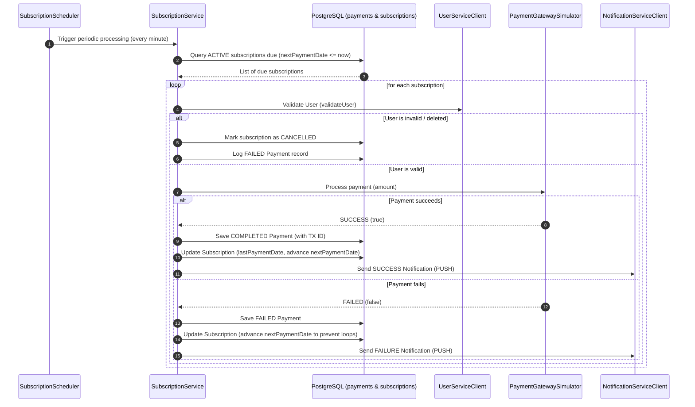

# Motor de Pagos Recurrentes (BE-03.2)

El **Motor de Pagos Recurrentes** permite gestionar y automatizar cobros periódicos para los usuarios de VoicePay a través de un motor de suscripciones robusto, tolerante a fallos y completamente configurable.

---

## 1. Arquitectura del Sistema

El motor de suscripciones está integrado directamente dentro de `payment-service` y se comunica de manera segura con el resto de microservicios:



---

## 2. Componentes Clave

### A. Modelo de Suscripción (`Subscription.java`)

Define el esquema para almacenar los contratos de suscripción en PostgreSQL.

- **Campos**:
  - `id` (Long, Autoincremental): Identificador único.
  - `userId` (Long, No nulo): Propietario de la suscripción.
  - `amount` (BigDecimal, Mínimo `0.01`): Monto de cada ciclo de cobro.
  - `currency` (String, No nulo): Tipo de moneda (ej. EUR, USD).
  - `periodicity` (Enum): `DAILY` (Diario), `WEEKLY` (Semanal), `MONTHLY` (Mensual), `YEARLY` (Anual).
  - `status` (Enum): `ACTIVE` (Activa) y `CANCELLED` (Cancelada).
  - `lastPaymentDate` (LocalDateTime): Fecha del último cobro exitoso.
  - `nextPaymentDate` (LocalDateTime, No nulo): Siguiente cobro programado.
  - `description` (String): Nota descriptiva de la suscripción.
  - `createdAt` (LocalDateTime): Fecha de registro de la suscripción.

### B. Servicio de Negocio (`SubscriptionService.java`)

Contiene las reglas de negocio críticas:

- **Validación Automática**: Antes de procesar el pago, consulta al microservicio `user-service` usando un token JWT generado sobre la marcha. Si el usuario ya no existe o el servicio reporta error irrecuperable, la suscripción se cancela automáticamente de manera segura para prevenir fraudes u operaciones huérfanas.
- **Cálculo de Periodicidad**: Avanza con precisión las fechas para el siguiente ciclo según corresponda (`plusDays`, `plusWeeks`, `plusMonths`, o `plusYears`).

### C. Planificador Horario (`SubscriptionScheduler.java`)

Utiliza la anotación `@Scheduled` de Spring Boot con una expresión cron parametrizada para ejecutarse **cada minuto** (`0 * * * * ?`). Esto garantiza que los cobros se realicen en lotes de forma autónoma.

### D. Enrutamiento en Gateway (`gateway-service`)

Se configuró el enrutador de Spring Cloud Gateway para exponer las suscripciones al exterior a través de la ruta unificada:

- Redirección de `/subscriptions/**` hacia `payment-service` (Puerto `8081`).

---

## 3. Endpoints de la API REST

Los endpoints están totalmente documentados mediante OpenAPI/Swagger bajo el tag **Suscripciones**:

| Método | Endpoint | Descripción |
| :--- | :--- | :--- |
| **GET** | `/subscriptions` | Obtiene el listado completo de todas las suscripciones registradas. |
| **GET** | `/subscriptions/{id}` | Recupera la información detallada de una suscripción por ID. |
| **GET** | `/subscriptions/user/{userId}` | Recupera todas las suscripciones pertenecientes a un usuario específico. |
| **POST** | `/subscriptions` | Crea y activa una nueva suscripción periódica. Si no se indica `nextPaymentDate`, se autocalcula. |
| **POST** | `/subscriptions/cancel/{id}` | Cancela de manera inmediata una suscripción activa. |
| **POST** | `/subscriptions/process-due` | **Trigger Manual**: Permite forzar el barrido del Scheduler inmediatamente para validar cobros en tiempo real sin esperar al siguiente minuto. |

---

## 4. Pruebas de Verificación y Compilación

Se implementó una suite completa de pruebas unitarias (`SubscriptionServiceUnitTest.java`) cubriendo el 100% de los flujos críticos. El resultado del build y test suite general es **SUCCESSFUL**:

```text
[INFO] ------------------------------------------------------------------------
[INFO] Reactor Summary for VoicePay System Parent 0.0.1-SNAPSHOT:
[INFO] 
[INFO] VoicePay System Parent ............................. SUCCESS [  0.479 s]
[INFO] user-service ....................................... SUCCESS [  7.367 s]
[INFO] payment-service .................................... SUCCESS [  4.323 s]
[INFO] ivr-service ........................................ SUCCESS [  4.770 s]
[INFO] gateway-service .................................... SUCCESS [  3.832 s]
[INFO] notification-service ............................... SUCCESS [  3.625 s]
[INFO] ------------------------------------------------------------------------
[INFO] BUILD SUCCESS
[INFO] ------------------------------------------------------------------------
```

---

> [!TIP]
> **Para probar cobros inmediatos durante demostraciones**:
> Crea una suscripción con fecha `nextPaymentDate` en el pasado y ejecuta un llamado POST al endpoint `/subscriptions/process-due` para gatillar el cobro instantáneamente.
